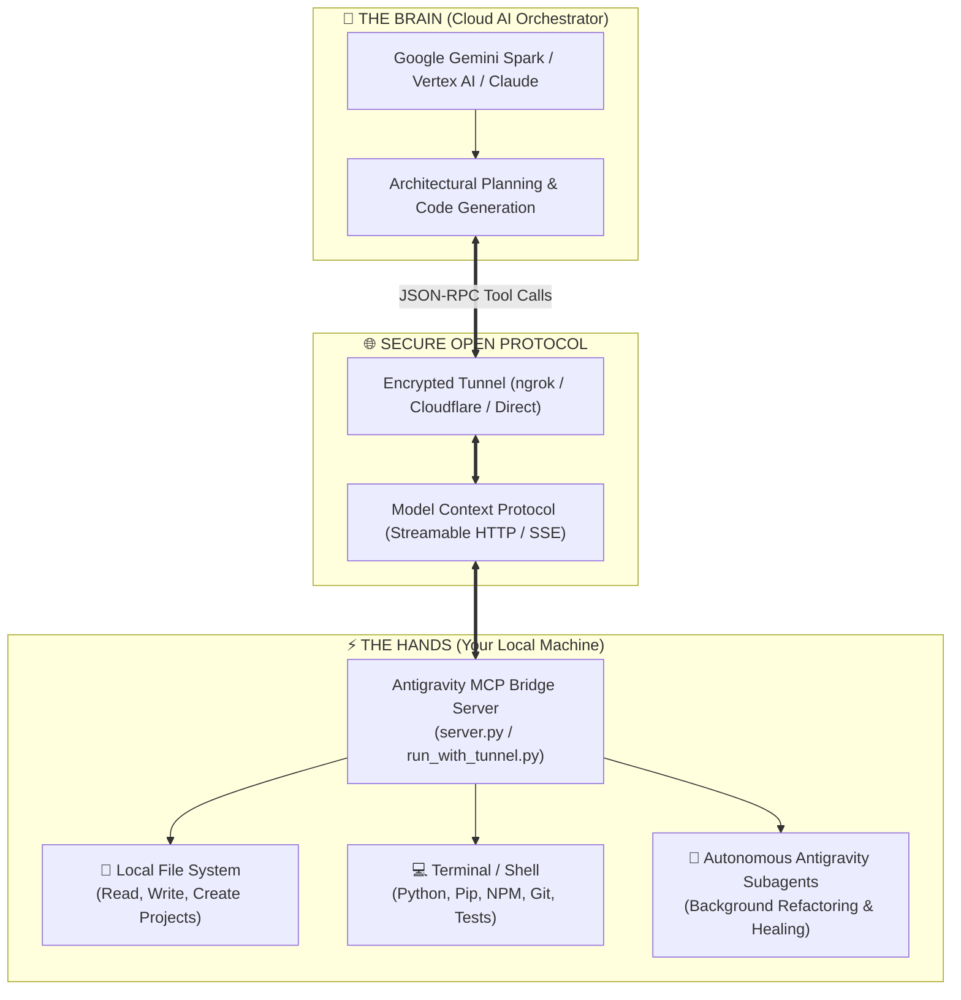

<div align="center">

# ⚡ Antigravity MCP Bridge
### *Transform Cloud AI into an Autonomous Local Software Engineer*

[-blue?style=for-the-badge&logo=google)](https://modelcontextprotocol.io)
[](https://python.org)
[](https://github.com/nandhakumar-murugan/antigravity-mcp-bridge)
[](LICENSE)

**Antigravity MCP Bridge** seamlessly bridges Cloud-based AI Orchestrators (such as **Google Gemini Spark**, Vertex AI, and Claude) with your local computer's operating system, compilers, terminals, and workspace files over the open **Model Context Protocol (MCP)**.

[Explore Features](#-core-features) • [Why This is Innovation](#-why-this-is-a-breakthrough-innovation) • [Benefits](#-who-benefits-students-engineers--researchers) • [Quickstart](#-quickstart--installation) • [Security](#-security--safety-guidelines)

</div>

---

## 🌟 What is the Antigravity MCP Bridge?

For years, AI coding assistants have been **trapped in browser chatboxes**. They could generate code, but you had to manually copy, paste, create files, resolve dependency conflicts, run terminal commands, and debug errors yourself.

**Antigravity MCP Bridge fundamentally changes this paradigm.**

By establishing a secure, high-speed **JSON-RPC Streamable HTTP / Server-Sent Events (SSE)** communication channel using the open **Model Context Protocol (MCP)**, the Cloud AI is granted **real execution capabilities ("Hands")** directly on your machine while keeping high-level cognitive planning ("Brain") in the cloud.

---

## 🏗️ Architectural Overview



---

## 🚀 Core Features & Capabilities

| Tool Name | Type | Description |
| :--- | :--- | :--- |
| **`run_system_command`** | `Terminal / Shell` | Executes shell / PowerShell / Bash commands (e.g. `python`, `npm test`, `pip install`, `git commit`). Captures stdout, stderr, and exit codes. |
| **`write_file`** | `File System` | Creates and updates source code files on disk. Automatically generates parent directory paths. |
| **`read_file`** | `File System` | Inspects and reads code, logs, datasets, and configuration files directly from your workspace. |
| **`list_directory`** | `File System` | Explores repository structure and inspects file trees in real time. |
| **`run_agent_task`** | `Agentic Core` | Spawns long-running, autonomous background Antigravity coding subagents for multi-step goals. |
| **`get_agent_status`** | `Monitoring` | Polls real-time progress, stdout, reasoning streams, and error diagnostics from running tasks. |
| **`terminate_task`** | `Lifecycle` | Safely halts running background tasks on demand. |

---

## 💡 Why This is a Breakthrough Innovation

1. **Zero Copy-Paste Friction**:
   * The developer or student simply states their objective in plain English. The AI creates the repository structure, writes production code, creates comprehensive unit test suites, executes them, fixes any failing tests, and commits the code autonomously.

2. **Decoupled "Brain + Hands" Architecture**:
   * **The Brain**: Cloud models provide world-class reasoning, huge context windows, and multi-modal understanding.
   * **The Hands**: Local machine provides private file storage, local CPU/GPU computing power, installed SDKs, and local network access.

3. **Universal Open Standard (MCP)**:
   * Built on Anthropic's and Google's open **Model Context Protocol**, avoiding closed vendor lock-in. Any MCP-compliant client can immediately utilize this bridge.

---

## 👥 Who Benefits? (Students, Engineers & Researchers)

### 🎓 1. For Students & Beginners
* **Overcoming "Tutorial Hell"**: Students can watch the AI construct real software step-by-step on their own disk rather than in isolated web sandboxes.
* **Instant Feedback & Self-Correction**: When tests fail, the AI receives terminal errors in real time and demonstrates how to debug and fix them.
* **Zero Setup Anxiety**: Removes the intimidation of command-line tools, virtual environments, and compiler configurations.

### 💻 2. For Professional Software Engineers
* **Massive Productivity Multiplication**: Offload boilerplate generation, unit test suite writing, repository migrations, and documentation creation.
* **Autonomous Test-Driven Development (TDD)**: The AI writes code, runs the test runner, analyzes failures, and iterates until 100% test coverage is achieved.
* **Context Preservation**: Stay focused on architectural decisions while the AI handles repetitive file creation and terminal operations.

### 🔬 3. For Data Scientists & AI Researchers
* **Automated Experimentation**: Command the AI to run local training jobs, hyperparameter sweeps, and benchmark tests, and stream back metrics.
* **Hardware Utilization**: Leverage local NVIDIA GPUs and local datasets without needing to upload sensitive data to third-party web tools.

---

## 📉 What Bottlenecks Does This Eliminate?

```
❌ TRADITIONAL WORKFLOW:
Prompt in Browser ➔ Copy Code ➔ Open IDE ➔ Create File ➔ Paste Code ➔ Open Terminal ➔ Run Command ➔ Error! ➔ Copy Error ➔ Paste to Browser ➔ Repeat (15+ minutes)

✅ ANTIGRAVITY MCP BRIDGE WORKFLOW:
Prompt ➔ AI Creates File + Executes Tests + Self-Heals Errors + Commits (10 seconds)
```

* **Eliminates Manual Copy-Pasting**: Direct disk and terminal synchronization.
* **Eliminates Hallucinated Code Incompatibility**: Because code is executed immediately in your real runtime, syntax or runtime bugs are detected and solved on the spot.
* **Eliminates Multi-App Context Switching**: Control your entire development environment from a unified conversational interface.

---

## 🧪 Real-World Verified Proof of Concept

During live testing, Gemini Spark was given a single instruction:
> *"Create a calculator module with arithmetic operations and execute unit tests."*

**What Happened Autonomously in Under 3 Seconds:**
1. Spark called `write_file` to create `calculator.py` with full type annotations and error handling.
2. Spark called `write_file` to create `test_calculator.py` with 6 unit test cases covering edge cases.
3. Spark called `run_system_command` to execute `python -m unittest test_calculator.py -v`.
4. All 6 tests passed with exit code 0, and output was reported back to the user interface.

---

## 🛠️ Quickstart & Installation

### Prerequisites
* **Python 3.10+** installed on your machine.
* A free **ngrok** account ([signup here](https://dashboard.ngrok.com/signup)) to obtain your Authtoken.

### 1. Clone the Repository
```bash
git clone https://github.com/nandhakumar-murugan/antigravity-mcp-bridge.git
cd antigravity-mcp-bridge
```

### 2. Install Dependencies
```bash
pip install -r requirements.txt
```

### 3. One-Click Run (with Integrated Tunnel)
Run the automated launcher:
```bash
start_server.bat
```
*(Or via Python: `python run_with_tunnel.py`)*

The launcher will:
* Launch the MCP Server on `http://127.0.0.1:8000`
* Initialize the secure ngrok public tunnel
* Display your public MCP endpoint:
  ```text
  [INFO] NGROK MCP TUNNEL IS LIVE!
  [LINK] PASTE THIS IN GEMINI SPARK: https://xxxx.ngrok-free.dev/mcp
  ```

---

## 🔗 Connecting to Google Gemini Spark

1. Open **Gemini Spark** / Google Gemini.
2. Navigate to **Custom Connected Apps** / **MCP Settings**.
3. In **"Add a custom app link"**, paste your URL:
   `https://<your-ngrok-domain>.ngrok-free.dev/mcp`
4. Accept the connection permissions and click **Next / Save**.
5. You can now mention `@Antigravity System Bridge` in any chat to control your local computer!

---

## 🛡️ Security & Safety Guidelines

* **Workspace Scoping**: Tools are scoped to your specified project directory to protect system critical files.
* **Token Authentication**: Secure your ngrok tunnels with authentication tokens.
* **Human-in-the-Loop**: You have complete visibility and control over what commands are executed on your machine.
* **Instant Cancellation**: Any running background task can be terminated instantly using `terminate_task`.

---

## 📄 License

This project is licensed under the **MIT License** — see the [LICENSE](LICENSE) file for details.

---

<div align="center">
<b>Built with ❤️ for the future of Autonomous Agentic Engineering.</b>
</div>
